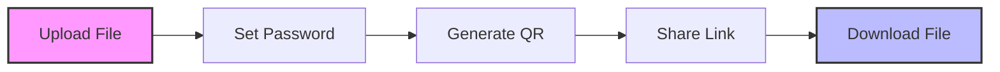

<!-- Animated Header -->
<div align="center">

# 🔗 ZipLink

[](https://nodejs.org/)
[](https://expressjs.com/)
[](https://developer.mozilla.org/en-US/docs/Web/JavaScript)
[](https://getbootstrap.com/)


</div>

## 🌟 Overview

ZipLink revolutionizes file sharing with a seamless peer-to-peer experience. Upload, protect, and share files with confidence using our intuitive interface. Whether you're sharing documents, images, or any digital content, ZipLink makes it simple and secure.

## ✨ Key Features

<div align="center">

| Feature | Description |
|---------|-------------|
| 🔒 **Secure Sharing** | Password protection for sensitive files |
| ⚡ **Quick Upload** | Drag-and-drop interface for effortless file sharing |
| 📱 **QR Access** | Instant file access via generated QR codes |
| ⏰ **Auto-Expiry** | 24-hour file expiration for enhanced security |
| 📊 **Progress Tracking** | Real-time upload progress monitoring |
| 🎯 **User Roles** | Dedicated interfaces for both senders and receivers |

</div>

## 🚀 Getting Started

```bash
# Clone the repository
git clone https://github.com/yourusername/ziplink.git

# Navigate to project directory
cd ziplink

# Install dependencies
npm install

# Start the server
npm start
```

## 💡 How It Works

<div align="center">



</div>

## 🎯 User Guide

### For File Senders

1. **Upload**
   - Drop files directly into the upload zone
   - Or click to select files manually

2. **Protect**
   - Set an optional password
   - Choose expiration time (default: 24 hours)

3. **Share**
   - Get instant QR code and shareable link
   - Copy link or share QR code directly

### For File Receivers

1. **Access**
   - Scan QR code or enter link
   - Input password if required

2. **Download**
   - Click to start download
   - View file details before downloading

## 🛠️ Technology Stack

<div align="center">

| Category | Technologies |
|----------|-------------|
| **Backend** |   |
| **Frontend** |    |
| **Libraries** |   |

</div>

## 🔮 Future Roadmap

<div align="center">

| Feature | Status | Description |
|---------|--------|-------------|
| 📚 File Versioning | Planned | Track and manage multiple file versions |
| 🔐 User Authentication | In Progress | Secure user accounts and file management |
| 📧 Email Notifications | Planned | Automated alerts for file activities |
| 🌓 Dark/Light Theme | Planned | Customizable interface themes |
| 👁️ File Preview | In Progress | Preview support for various file types |

</div>

## 🤝 Contributing

We welcome contributions! Here's how you can help:

1. 🍴 Fork the repository
2. 🌿 Create your feature branch (`git checkout -b feature/AmazingFeature`)
3. 💾 Commit changes (`git commit -m 'Add AmazingFeature'`)
4. 📤 Push to branch (`git push origin feature/AmazingFeature`)
5. 🔄 Open a Pull Request

## 📝 License

This project is licensed under the MIT License - see the [LICENSE](LICENSE) file for details.

---

<div align="center">

**Created with ❤️ by Vivek**

[⬆ Back to Top](#ziplink)

<sub>Powered by Node.js and Express</sub>

</div>