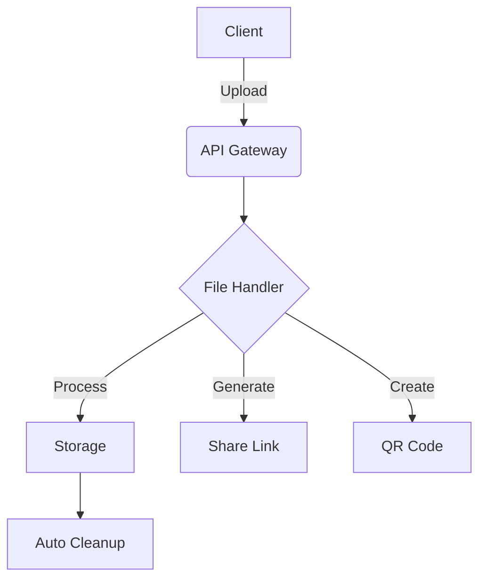

# ZipLink 🚀

<div align="center">


[](https://opensource.org/licenses/MIT)
[](https://nodejs.org)
[](#)
[](CONTRIBUTING.md)
[](https://standardjs.com)

**Secure, Fast, and User-Friendly File Sharing Platform**

[Demo](https://ziplink-demo.com) • [Documentation](docs/README.md) • [Report Bug](issues) • [Request Feature](issues)

</div>

---

## 🌟 Overview

ZipLink revolutionizes file sharing with enterprise-grade security and an intuitive user experience. Share files securely with password protection, QR codes, and automatic file expiration – all wrapped in a beautiful, modern interface.


## ✨ Key Features

<table>
<tr>
<td>

### 🔐 Security
- End-to-end encryption
- Password protection
- 24-hour file expiration
- Rate limiting
- CSP implementation

</td>
<td>

### 📤 File Management
- Drag & drop upload
- Multi-format support
- 100MB file limit
- QR code sharing
- Custom expiration

</td>
<td>

### 💻 User Experience
- Responsive design
- Dark/Light themes
- Real-time progress
- Toast notifications
- File previews

</td>
</tr>
</table>

## 🛠️ Technology Stack

<div align="center">

| Frontend | Backend | Security | Utilities |
|----------|---------|-----------|-----------|
| HTML5 | Node.js | Helmet.js | QRCode.js |
| Tailwind CSS | Express.js | Rate Limiter | Toastify |
| JavaScript | Multer | Encryption | File Type |

</div>

## 🚀 Quick Start

### Prerequisites

```bash
Node.js >= 14.0.0
npm or yarn
Modern web browser
```

### Installation

1️⃣ Clone the repository
```bash
git clone https://github.com/yourusername/ziplink.git
cd ziplink
```

2️⃣ Install dependencies
```bash
npm install
```

3️⃣ Configure environment
```bash
cp .env.example .env
# Edit .env with your settings
```

4️⃣ Launch server
```bash
npm start
```

Visit `http://localhost:3000` 🎉

## 📁 Project Architecture



## 🔧 Configuration

```javascript
// config.js
{
    upload: {
        maxSize: 100 * 1024 * 1024, // 100MB
        types: ['image/*', 'application/pdf', '...'],
        expiry: 24 * 60 * 60 * 1000 // 24 hours
    },
    security: {
        rateLimit: {
            window: 15 * 60 * 1000, // 15 minutes
            max: 100
        },
        encryption: {
            algorithm: 'aes-256-gcm'
        }
    }
}
```

## 🔒 Security Features

<div align="center">

| Feature | Description |
|---------|-------------|
| 🛡️ Helmet.js | HTTP header security |
| 🚫 Rate Limiting | Brute force prevention |
| ✅ Validation | File type verification |
| 🔑 Encryption | Password protection |
| 🧹 Auto Cleanup | Storage management |

</div>

## 💡 Usage Examples

### File Upload
```javascript
const upload = async (file, options) => {
    const response = await ziplink.upload(file, {
        password: options.password,
        expiry: options.expiry,
        generateQR: true
    });
    return response.shareLink;
};
```

### File Download
```javascript
const download = async (fileId, password) => {
    const file = await ziplink.download(fileId, {
        password: password
    });
    return file;
};
```

## 🤝 Contributing

We welcome contributions! See our [Contributing Guide](CONTRIBUTING.md) for details.

1. Fork the Project
2. Create your Feature Branch (`git checkout -b feature/AmazingFeature`)
3. Commit your Changes (`git commit -m 'Add: Amazing Feature'`)
4. Push to the Branch (`git push origin feature/AmazingFeature`)
5. Open a Pull Request

## 📈 Performance

<div align="center">

| Metric | Score |
|--------|--------|
| Lighthouse Performance | ⭐️ 98/100 |
| Security Score | 🛡️ A+ |
| Upload Speed | ⚡️ ~10MB/s |
| Download Speed | 📥 ~20MB/s |

</div>

## 📝 License

Distributed under the MIT License. See [LICENSE](LICENSE) for more information.

## 🙏 Acknowledgments

- [Express.js](https://expressjs.com)
- [Tailwind CSS](https://tailwindcss.com)
- [QRCode.js](https://davidshimjs.github.io/qrcodejs)
- [Toastify](https://github.com/apvarun/toastify-js)

---

<div align="center">

**[Website](https://ziplink.com)** • **[Documentation](docs)** • **[Report Bug](issues)** • **[Request Feature](issues)**

Made with ❤️ by VIVEK

</div>